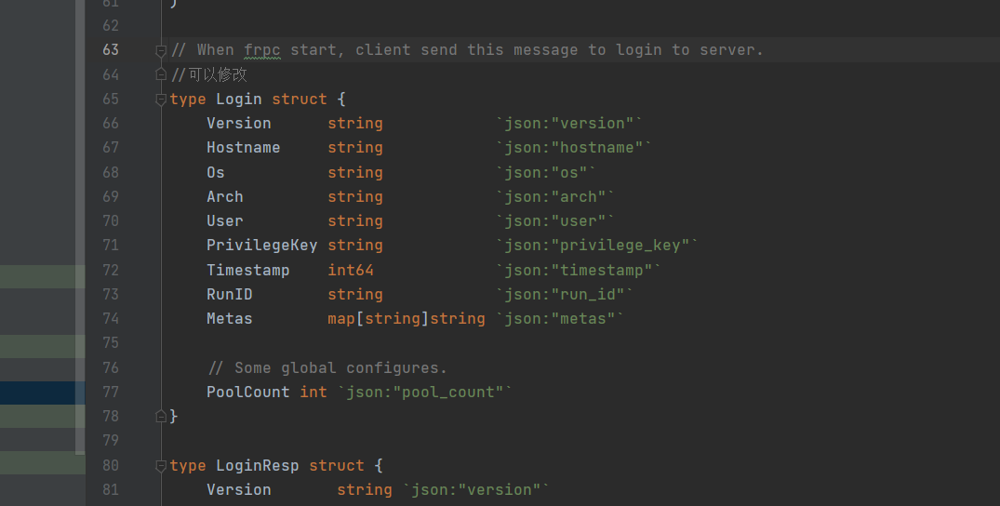
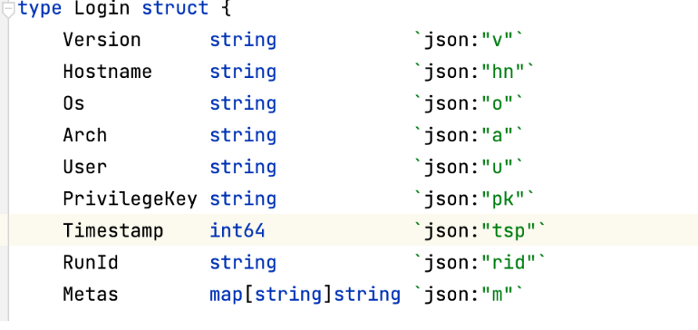
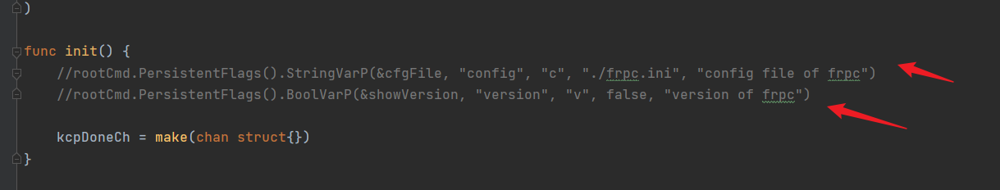
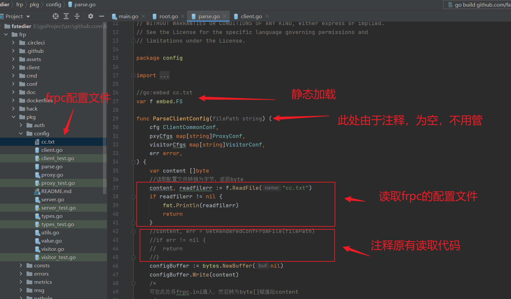
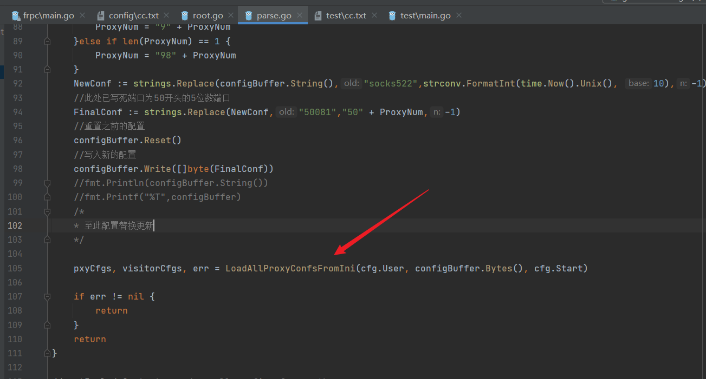
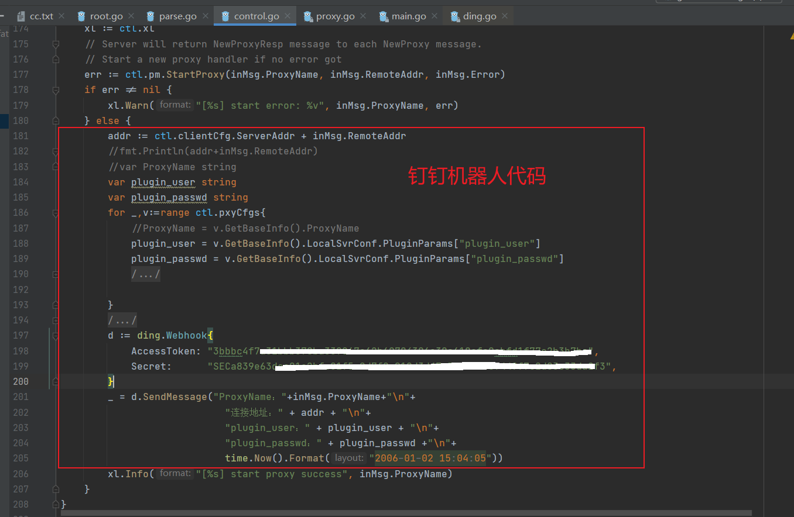
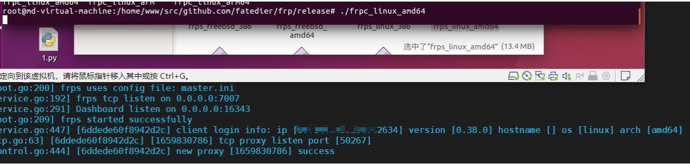
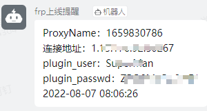

# Frp改造计划

## 一、流量改造

注意此项应该放在最后做，因为`tls.go`是客户端和服务端共用的，服务端必须使用编译后的`frps`，否则`frpc`无法连接成功

修改`frp/pkg/util/net/tls.go`文件

改变默认的流量特征

```Go
package net

import (
	"crypto/tls"
	"fmt"
	"net"
	"time"

	gnet "github.com/fatedier/golib/net"
)

var (
	//可以修改
	FRPTLSHeadByte = 0x17
	//FRPTLSHeadByte = 0x19
)

func WrapTLSClientConn(c net.Conn, tlsConfig *tls.Config, disableCustomTLSHeadByte bool) (out net.Conn) {
	if !disableCustomTLSHeadByte {
		//可以修改
		c.Write([]byte{byte(FRPTLSHeadByte)})
		//修改后如下
		//c.Write([]byte{byte(FRPTLSHeadByte),byte(0x77),byte(0x78)})
	}
	out = tls.Client(c, tlsConfig)
	return
}

func CheckAndEnableTLSServerConnWithTimeout(
	c net.Conn, tlsConfig *tls.Config, tlsOnly bool, timeout time.Duration,
) (out net.Conn, isTLS bool, custom bool, err error) {
	//可以修改
	sc, r := gnet.NewSharedConnSize(c, 2)
	buf := make([]byte, 1)
	//修改后如下
	//sc, r := gnet.NewSharedConnSize(c, 4)
	//buf := make([]byte, 3)
	var n int
	c.SetReadDeadline(time.Now().Add(timeout))
	n, err = r.Read(buf)
	c.SetReadDeadline(time.Time{})
	if err != nil {
		return
	}
	//可以修改
	if n == 1 && int(buf[0]) == FRPTLSHeadByte {
		out = tls.Server(c, tlsConfig)
		isTLS = true
		custom = true
	} else if n == 1 && int(buf[0]) == 0x16 {
		out = tls.Server(sc, tlsConfig)
		isTLS = true
	} else {
		if tlsOnly {
			err = fmt.Errorf("non-TLS connection received on a TlsOnly server")
			return
		}
		out = sc
	}
	//修改后如下
	//if n == 3 && int(buf[0]) == FRPTLSHeadByte {
	//	out = tls.Server(c, tlsConfig)
	//	isTLS = true
	//	custom = true
	//此处的0x19要和FRPTLSHeadByte的值相同
	//} else if n == 3 && int(buf[0]) == 0x19 {
	//	out = tls.Server(sc, tlsConfig)
	//	isTLS = true
	//} else {
	//	if tlsOnly {
	//		err = fmt.Errorf("non-TLS connection received on a TlsOnly server")
	//		return
	//	}
	//	out = sc
	//}
	return
}
```

## 二、配置文件改造

目的：将配置文件直接写进源码中

需要解决的问题：

- 端口随机化，需要判断`frps`的端口是否被占用
- 每个`frpc`的代理服务名称（可采用16位的随机数）
- 是否放弃`frps`的`UI`（适合大项目），采用钉钉的机器人播报（适合小项目）

### 修改连接认证特征

位于`frp/pkg/msg/msg.go`65行的Login结构体，用于连接后发送相应信息。当`tls_enable`为`false`时这些数据回明文传输；当`tls_enable`为`true`时可忽略此处理。



可改为



### `frpc.ini`写入

注释掉`frp/cmd/frpc/sub/root.go`的参数获取，不再从命令行获取参数



在`frp/pkg/config/parse.go`中做出如下改变



每次只需要更改配置文件就更改`cc.txt`即可

单独编译`frpc`，`frps`无需再次编译（前提是使用已经编译好经过改动的`frps`，否则会提示Login错误）

```
go build -trimpath -ldflags "-s -w"  -buildvcs=false -o bin/frpc ./cmd/frpc
```

`frpc.ini`也就是代码中的`cc.txt`内容如下：

```
[common]
server_addr = frps-ip
server_port = frps-server-port
auth_token = Admin@123456
use_encryption = true
use_compression = true
tls_enable = true

#下列内容做了字符串替换，如要改变，需改变代码，详见修改代理名称和端口
[socks522] 
type = tcp
remote_port = 50081
plugin = socks5
use_compression = true
#socks5连接口令 [根据实际情况进行配置]
plugin_user = username
plugin_passwd = password
```


### 修改代理名称和端口

- 由于`frpc.ini`中`remote_port`只有一个端口可供使用，而实战中是不可能只使用一个端口的，采用方法为`frpc.ini`将`remote_port`随机化
- 同时`proxy_name`也是不能重复使用的，采用的方式是使用时间戳来代替

修改地址位于`frp/pkg/config/parse.go`的`ParseClientConfig`方法中

修改内容为在`LoadAllProxyConfsFromIni`方法调用执行前加入替换配置文件代码



替换代码如下：

```
	/*
	 配置文件更改核心部分
	 proxy_name 使用时间戳
	 remote_port := "50081"
	*/
	rand.Seed(time.Now().UnixNano())
	random := rand.Intn(1000)
	ProxyNum := strconv.Itoa(random)
	if len(ProxyNum) == 2{
		ProxyNum = "9" + ProxyNum
	}else if len(ProxyNum) == 1 {
		ProxyNum = "98" + ProxyNum
	}
	NewConf := strings.Replace(configBuffer.String(),"socks522",strconv.FormatInt(time.Now().Unix(), 10),-1)
	//此处已写死端口为50开头的5位数端口
	FinalConf := strings.Replace(NewConf,"50081","50" + ProxyNum,-1)
	//重置之前的配置
	configBuffer.Reset()
	//写入新的配置
	configBuffer.Write([]byte(FinalConf))
	//fmt.Println(configBuffer.String())
	//fmt.Printf("%T",configBuffer)
	/*
	* 至此配置替换更新
	*/
```

### 加入钉钉机器人

修改代码位于`frp/client/control.go`的`HandleNewProxyResp`中

需引入包`github.com/wanghuiyt/ding`

```
go get -u github.com/wanghuiyt/ding
go mod init
```



### 效果图：

`frpc`在正常运行后不会有任何输出，同时由于不再接受命令行参数，经名称混淆后，相较难以识别。



钉钉机器人播报：



经过改动后确实较为方便，但是还是建议小项目使用这个，大项目使用`frps`自带的web管理端，更易识别。

# 免责声明

本工具仅面向**合法授权**的企业安全建设行为，如您需要测试本工具的可用性，请自行搭建靶机环境。

在使用本工具进行使用时，您应确保该行为符合当地的法律法规，并且已经取得了足够的授权。**请勿对非授权目标进行测试。**

如您在使用本工具的过程中存在任何非法行为，您需自行承担相应后果，我们将不承担任何法律及连带责任。

在安装并使用本工具前，请您**务必审慎阅读、充分理解各条款内容**，限制、免责条款或者其他涉及您重大权益的条款可能会以加粗、加下划线等形式提示您重点注意。 除非您已充分阅读、完全理解并接受本协议所有条款，否则，请您不要安装并使用本工具。您的使用行为或者您以其他任何明示或者默示方式表示接受本协议的，即视为您已阅读并同意本协议的约束。

# 感谢

向参考中的四个链接/项目表示感谢，向`frp`作者及广大社区代码提交者致以敬意，也希望一直延续开源精神。

致敬同行。

# 参考

`https://github.com/fatedier/frp`

`https://www.modb.pro/db/375258`

`https://uknowsec.cn/posts/notes/FRP%E6%94%B9%E9%80%A0%E8%AE%A1%E5%88%92.html`

`https://github.com/wanghuiyt/ding`


